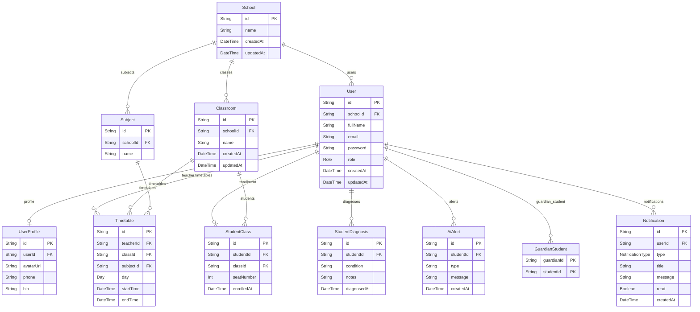

# Learno SDC Database ERD (MVP)

```mermaid
erDiagram
    School ||--o{ User : "users"
    School ||--o{ Classroom : "classes"
    School ||--o{ Subject : "subjects"

    User ||--o| UserProfile : "profile"
    User ||--o{ Timetable : "teacher timetables"
    User ||--o| StudentClass : "enrollment"
    User ||--o{ StudentDiagnosis : "diagnoses"
    User ||--o{ AiAlert : "alerts"
    User ||--o{ GuardianStudent : "guardian_student"
    User ||--o{ Notification : "notifications"

    Classroom ||--o{ Timetable : "timetables"
    Classroom ||--o{ StudentClass : "students"

    Subject ||--o{ Timetable : "timetables"

    School {
        String id PK
        String name
        DateTime createdAt
        DateTime updatedAt
    }

    User {
        String id PK
        String schoolId FK
        String fullName
        String email
        String password
        Role role
        DateTime createdAt
        DateTime updatedAt
    }

    UserProfile {
        String id PK
        String userId FK
        String avatarUrl
        String phone
        String bio
    }

    GuardianStudent {
        String guardianId PK
        String studentId PK
    }

    Classroom {
        String id PK
        String schoolId FK
        String name
        DateTime createdAt
        DateTime updatedAt
    }

    StudentClass {
        String id PK
        String studentId FK
        String classId FK
        Int seatNumber
        DateTime enrolledAt
    }

    Subject {
        String id PK
        String schoolId FK
        String name
    }

    Timetable {
        String id PK
        String teacherId FK
        String classId FK
        String subjectId FK
        Day day
        DateTime startTime
        DateTime endTime
    }

    AiAlert {
        String id PK
        String studentId FK
        String type
        String message
        DateTime createdAt
    }

    StudentDiagnosis {
        String id PK
        String studentId FK
        String condition
        String notes
        DateTime diagnosedAt
    }

    Notification {
        String id PK
        String userId FK
        NotificationType type
        String title
        String message
        Boolean read
        DateTime createdAt
    }
```
